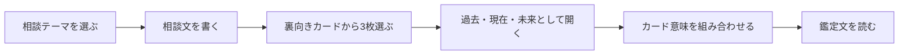

<div align="center">

# LUNARIA TAROT

### 月明かりの下で、3枚のカードから自分を見つめる。

LUNARIA TAROTは、相談テーマと3枚引きカードから、静かな雰囲気のタロットリーディングを楽しめるブラウザアプリです。

[App](./lunaria-tarot/index.html) · [Source](./lunaria-tarot) · [License](./lunaria-tarot/LICENSE)

</div>

<div align="center">


</div>

---

## Overview

LUNARIA TAROTは、外部AI、APIキー、サーバー、課金なしで動くタロットWebアプリです。

ユーザーは相談テーマを選び、必要に応じて相談文を書き、裏向きのカードから3枚を選びます。選ばれたカードは過去・現在・未来として開かれ、テーマとカードの意味に合わせた鑑定文をブラウザ内だけで生成します。

単なるカード表示ではなく、「雰囲気」「選ぶ体験」「読み解き」の流れまで含めて、ひとつの小さな占い体験として実装しています。

## What Makes It Different

| よくあるタロットページ | LUNARIA TAROT |
| --- | --- |
| ランダムに結果だけ出る | 自分で3枚を選ぶ体験を入れている |
| カード意味の羅列になりがち | 相談テーマに合わせて文章を組み立てる |
| サーバーやAPIが必要 | ブラウザだけで動く |
| 雰囲気が薄い | 月・星・静かな夜の世界観で統一 |

## Reading Flow



## Features

- 大アルカナ22枚を収録
- 正位置・逆位置に対応
- 恋愛、仕事、人間関係、その他の相談テーマ
- 過去・現在・未来の3枚引き
- 相談文とカードに応じた鑑定文生成
- ブラウザ内だけで動作
- スマートフォンとPCに対応
- GitHub Pagesで公開しやすい静的構成

## Tech Stack

```txt
HTML
CSS
JavaScript
```

外部ライブラリ、AI API、サーバーは使っていません。

## Project Structure

```txt
lunaria-tarot/
├─ README.md
└─ lunaria-tarot/
   ├─ index.html
   ├─ styles.css
   ├─ app.js
   ├─ README.md
   ├─ LICENSE
   ├─ .gitignore
   └─ .nojekyll
```

## Getting Started

1. このリポジトリをコピーまたはダウンロードします。
2. `lunaria-tarot/index.html` をブラウザで開きます。
3. 相談テーマを選びます。
4. 必要であれば相談文を書きます。
5. 裏向きのカードから3枚を選びます。
6. カードをめくり、鑑定結果を読みます。

## GitHub Pages

GitHub Pagesで公開する場合は、`lunaria-tarot` フォルダの中身をリポジトリのルートに置くか、Pagesの公開対象に合わせて配置を調整します。

## Notes

この鑑定は、娯楽と自己整理の補助としてお楽しみください。医療、法律、金銭などの重要な判断は、必要に応じて専門家へご相談ください。

## License

Copyright (c) 2026 Ryoup. All rights reserved.
